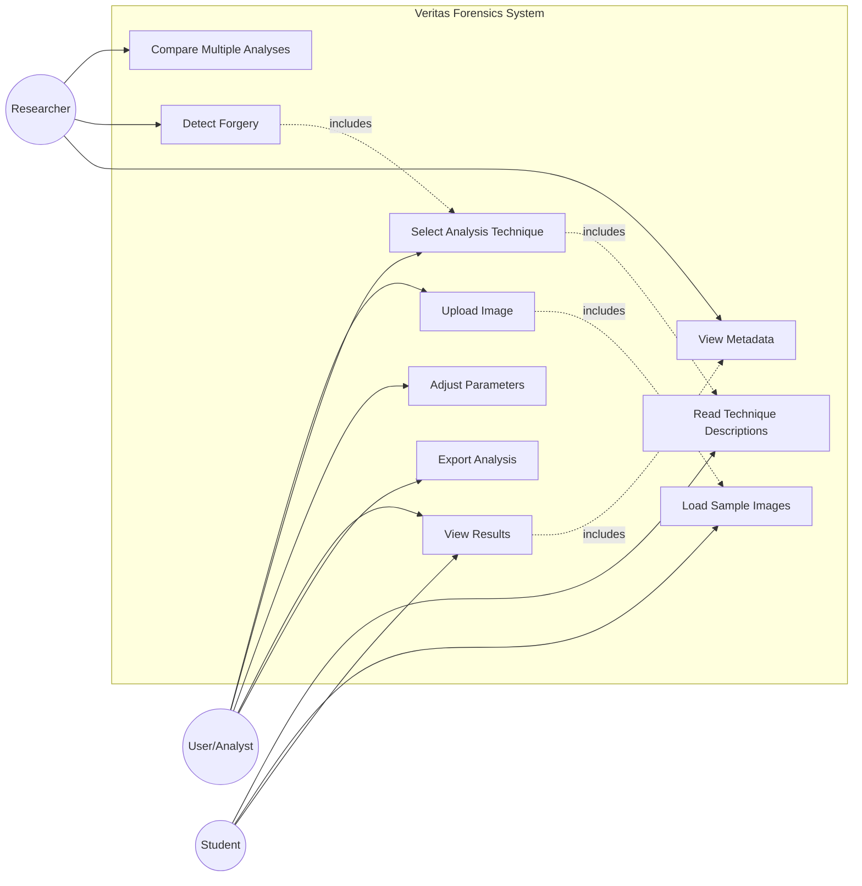
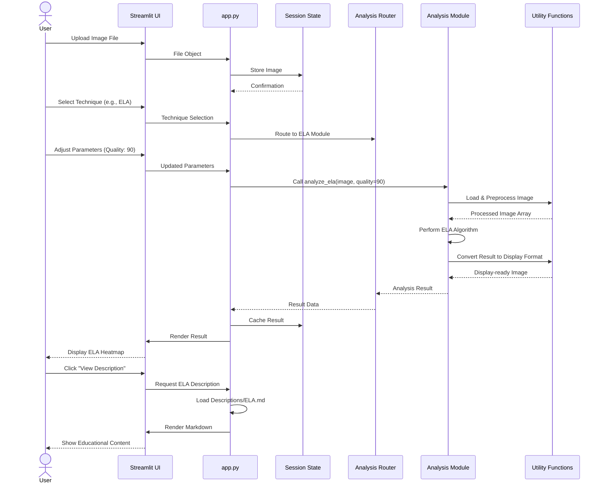
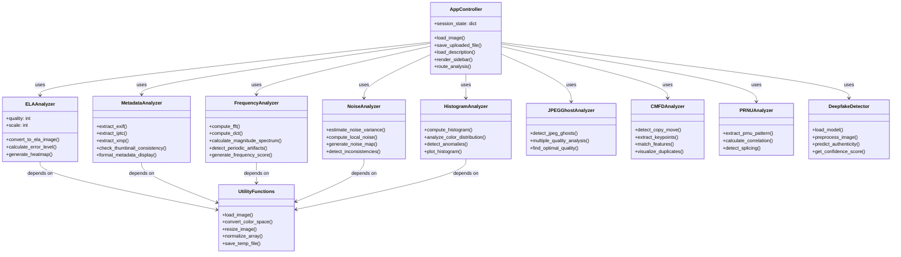
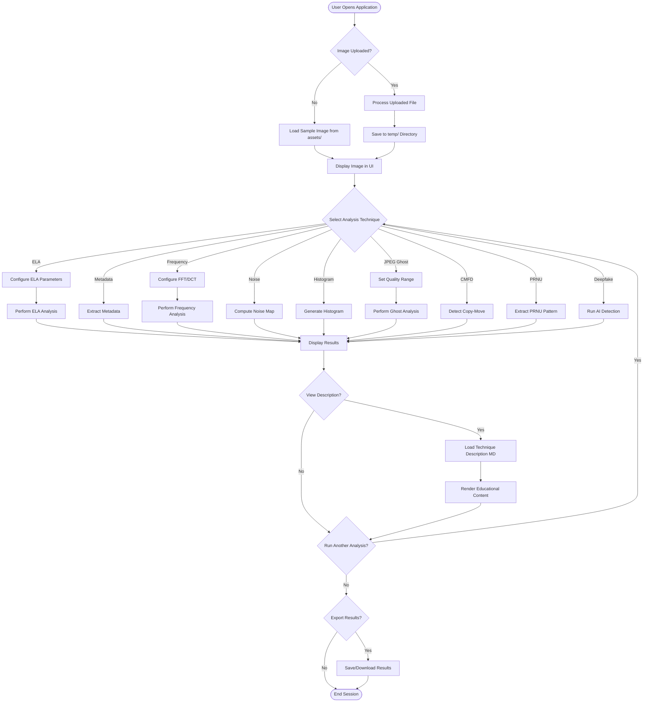
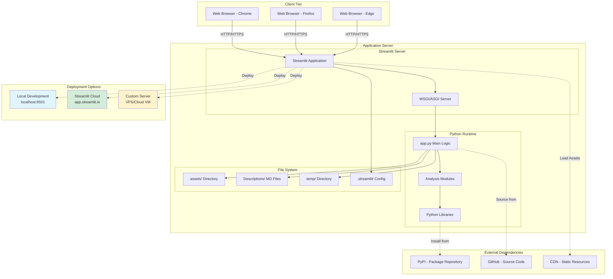

# Project Documentation Report

 
 
 
 
 

# Veritas Forensics

## Digital Image Forensic Analysis Toolkit

 
 

**Author:**  
Rafay Adeel

 
 
 
 

## 2. Table of Contents

1. [Title Page](#project-documentation-report)
2. [Table of Contents](#2-table-of-contents)
3. [Introduction](#3-introduction)
4. [Purpose of the Project](#4-purpose-of-the-project)
5. [Problem Statement](#5-problem-statement)
6. [Objectives](#6-objectives)
7. [Scope of the Project](#7-scope-of-the-project)
8. [Literature Review](#8-literature-review)
9. [System Requirements](#9-system-requirements)
10. [Functional Requirements](#10-functional-requirements)
11. [Non-Functional Requirements](#11-non-functional-requirements)
12. [Hardware and Software Requirements](#12-hardware-and-software-requirements)
13. [System Design](#13-system-design)
14. [UML Diagrams](#14-uml-diagrams)
    - [System Architecture Diagram](#141-system-architecture-diagram)
    - [Use Case Diagram](#142-use-case-diagram)
    - [Sequence Diagram](#143-sequence-diagram)
    - [Class Diagram](#144-class-diagram)
    - [Activity Diagram](#145-activity-diagram)
    - [Component Diagram](#146-component-diagram)
    - [Deployment Diagram](#147-deployment-diagram)
15. [Implementation Details](#15-implementation-details)
16. [Development Tools and Technologies](#16-development-tools-and-technologies)
17. [Programming Languages and Frameworks](#17-programming-languages-and-frameworks)
18. [Testing Strategy](#18-testing-strategy)
19. [Results and Discussion](#19-results-and-discussion)
20. [Conclusion](#20-conclusion)

## 3. Introduction

The credibility of digital imagery is a critical concern in journalism, criminal investigations, intelligence analysis, and everyday social media use. With the increasing sophistication of image editing tools and the proliferation of AI-generated content, traditional forms of visual verification have become inadequate. As a result, **Digital Image Forensics** has emerged as a specialized discipline aimed at examining images for authenticity, origin, and integrity.

**Veritas Forensics** is a digital image analysis toolkit developed as a semester project to provide a practical, hands-on platform for exploring forensic techniques. The application consolidates common forensic workflows—such as metadata inspection, error level analysis, noise pattern analysis, and frequency-domain inspection—into a single, web-based interface built with Streamlit. This report documents the motivation, design, and implementation of the system.

## 4. Purpose of the Project

The primary purpose of Veritas Forensics is to support **semi-automated forensic analysis of digital images** in an accessible manner. Rather than replacing experts, the toolkit is designed to augment human judgment by:

- Providing visualizations that make subtle artifacts easier to detect.
- Offering structured access to multiple forensic perspectives on the same image.
- Serving as an educational resource for students and practitioners who are new to image forensics.

By open-sourcing the toolkit, we further aim to encourage experimentation and extension by the research and academic community.

## 5. Problem Statement

The project addresses the following core problem:

> **How can we provide a unified, intuitive platform that enables users to perform multi-technique digital image forensic analysis without requiring deep expertise in image processing or programming?**

Specific challenges include:

1. **Fragmentation of Tools**: Many forensic algorithms exist only as research prototypes, scripts, or standalone command-line tools.
2. **Usability Barriers**: Non-technical users often struggle to install dependencies, understand parameters, and interpret raw numerical outputs.
3. **Rapid Evolution of Threats**: As generative models and editing tools advance, forensic methods must be continuously evaluated and combined.

Veritas Forensics seeks to mitigate these issues by integrating a curated set of well-established forensic techniques into a cohesive toolkit with an emphasis on usability and interpretability.

## 6. Objectives

The objectives of the project are:

1. **Integration Objective**: Combine multiple digital image forensic techniques (ELA, metadata analysis, histogram inspection, noise analysis, and frequency-domain inspection) into a single Streamlit application.
2. **Usability Objective**: Design an interface that allows a first-time user to upload an image and run at least one analysis within a minute.
3. **Educational Objective**: Provide in-application descriptions, examples, and interpretive hints for each forensic technique via the `Descriptions/` module.
4. **Technical Objective**: Implement modular, testable Python code for each analysis routine following best practices.
5. **Performance Objective**: Ensure responsiveness for typical image sizes used on the web (up to ~12 megapixels) on commodity hardware.

## 7. Scope of the Project

The scope is intentionally focused to maintain feasibility within a semester:

**Included in Scope**

- Analysis of **static images** (JPEG, PNG, TIFF) only.
- A set of **classical forensic techniques**: Error Level Analysis, metadata extraction, histogram analysis, noise-based inspection, and frequency analysis.
- A **web-based front end** using Streamlit with a sidebar for navigation between techniques.
- Sample images and preloaded configurations for demonstration and teaching.

**Excluded from Scope**

- Video forensics and audio analysis.
- Automated deepfake detection using large neural networks.
- Full case management features (e.g., chain-of-custody, report generation in legal formats).

## 8. Literature Review

The design of Veritas Forensics draws inspiration from established academic work in digital image forensics.

1. **JPEG Compression and Error Level Analysis (ELA)**  
   Krawetz (2007) discussed the use of _Error Level Analysis_ as a heuristic to reveal regions of an image that have undergone different levels of compression. Because JPEG is lossy, repeatedly saving an image at the same quality should lead to relatively uniform error across the image. Regions that were inserted or heavily edited may exhibit different error characteristics, appearing as brighter or darker zones in an ELA visualization.

2. **Forensic Analysis in the Frequency Domain**  
   Fridrich, Soukal, and Lukáš (2003) and subsequent works have examined the impact of resampling, scaling, and rotation on the periodic structure of images. These operations often introduce detectable periodicities and patterns in the Discrete Fourier Transform (DFT) or Discrete Cosine Transform (DCT) domains. Peaks and regular patterns in the magnitude spectrum are frequently associated with copy-move forgeries and resampling artifacts.

3. **Metadata and Device Forensics**  
   Research by Kee et al. and others has highlighted the importance of **Exchangeable Image File Format (EXIF)** metadata for forensics. Inconsistencies between embedded thumbnails, capture timestamps, camera model identifiers, and software tags can provide strong circumstantial evidence that an image has been edited. For instance, an EXIF tag indicating "Adobe Photoshop" may be suspicious when the context implies an original, unedited photograph.

4. **Noise Patterns and Sensor Fingerprints**  
   Mahdian and Saic (2009) and Lukáš et al. emphasized the role of **Photo-Response Non-Uniformity (PRNU)**, a unique noise pattern associated with individual camera sensors. While Veritas Forensics does not implement full PRNU-based source attribution, it adopts the principle that noise statistics can reveal inconsistencies between regions of an image, and leverages local noise estimation as a basic diagnostic.

5. **Comprehensive Surveys**  
   Survey papers in digital image forensics (e.g., Farid, 2009; Stamm, Wu, & Liu, 2013) underscore that no single technique is universally reliable. Instead, robust analysis comes from synthesizing evidence across multiple domains (spatial, frequency, metadata, noise). This motivates the toolkit’s multi-module design.

## 9. System Requirements

To deploy and run Veritas Forensics, the following system requirements are recommended:

- **Operating Systems**: Windows 10/11, macOS 10.14+, or a modern Linux distribution.
- **Python Version**: Python 3.9 or later.
- **Installed Libraries** (via `requirements.txt`):
  - `streamlit`
  - `opencv-python`
  - `numpy`
  - `Pillow`
  - `scipy`
  - `matplotlib` or `plotly`

Network connectivity is required only for installing dependencies and, optionally, for deploying on cloud platforms such as Streamlit Community Cloud or Heroku.

## 10. Functional Requirements

1. **FR-01 Image Ingestion**: The system shall allow users to upload image files (JPEG, PNG, TIFF) through a browser-based interface.
2. **FR-02 Sample Image Loading**: The system shall automatically load a default sample image if the user does not upload one, enabling immediate experimentation.
3. **FR-03 Technique Navigation**: The user shall be able to select an analysis module (ELA, Metadata, Histogram, Noise, Frequency, etc.) from the sidebar.
4. **FR-04 Parameter Adjustment**: For applicable techniques (e.g., ELA quality, histogram bin size), the system shall provide controls such as sliders or dropdowns to adjust parameters.
5. **FR-05 Result Visualization**: The system shall display visual outputs (processed images, heatmaps, histograms, magnitude spectra) within the same page.
6. **FR-06 Textual Explanations**: The system shall present textual summaries or interpretations alongside visual outputs to guide novice users.
7. **FR-07 Technique Descriptions**: The system shall provide separate, detailed descriptions for each forensic method via the `Descriptions/` section.

## 11. Non-Functional Requirements

1. **NFR-01 Performance**: Typical analyses for images up to 12 megapixels should complete in under 5 seconds on a mid-range laptop.
2. **NFR-02 Scalability**: The system should support concurrent users when deployed on a cloud platform, constrained mainly by the hosting provider.
3. **NFR-03 Reliability**: The application should handle invalid or corrupted input images gracefully and display appropriate error messages.
4. **NFR-04 Security**: Uploaded images should be processed in-memory or stored only temporarily; the system should not expose user data publicly.
5. **NFR-05 Maintainability**: The codebase should be modular, with each analysis approach implemented in its own module under `analysis/`.
6. **NFR-06 Portability**: The toolkit should be installable on different operating systems using a single `requirements.txt` file.

## 12. Hardware and Software Requirements

**Hardware Requirements**

- CPU: Dual-core processor (Intel Core i5 or equivalent) or better.
- Memory: Minimum 4 GB RAM (8 GB recommended).
- Disk Space: At least 1 GB free space for Python environment, packages, and cached images.

**Software Requirements**

- Python 3.9+
- `pip` or `conda` for dependency management.
- Code editor such as Visual Studio Code or PyCharm.
- Web browser (Chrome, Firefox, Edge) compatible with modern HTML5 features.

## 13. System Design

The architecture of Veritas Forensics can be described in terms of layers and components.

1. **Presentation Layer (UI)**

   - Implemented with Streamlit in `app.py`.
   - Responsible for rendering controls, handling image uploads, and displaying outputs.

2. **Application Logic Layer**

   - Contains the orchestration logic that selects which analysis routine to run based on user input.
   - Manages session state (e.g., currently loaded image, current technique).

3. **Analysis Modules Layer**

   - Located in the `analysis/` directory.
   - Each module (e.g., `ela.py`, `frequency_analysis.py`, `metadata_analysis.py`, `noise_analysis.py`) encapsulates a specific forensic method.

4. **Resources and Documentation Layer**
   - `assets/` contains sample images and static resources.
   - `Descriptions/` contains technique-specific Markdown files used to educate users.

A typical interaction flow is:

User uploads or selects image → `app.py` reads image → image converted to appropriate format (NumPy array or PIL image) → selected analysis function is called → result (image/plot/text) returned → Streamlit renders the output.

## 14. UML Diagrams

### 14.1. System Architecture Diagram

The following diagram illustrates the overall system architecture with its three-tier design pattern:

```mermaid
graph TB
    subgraph "Presentation Layer"
        UI[Streamlit Web Interface]
        FileUpload[File Upload Component]
        Sidebar[Sidebar Navigation]
        Display[Result Display Area]
    end

    subgraph "Application Logic Layer"
        AppController[app.py Controller]
        SessionMgmt[Session State Manager]
        Router[Analysis Router]
        DescLoader[Description Loader]
    end

    subgraph "Analysis Modules Layer"
        ELA[ela.py - Error Level Analysis]
        META[metadata_analysis.py]
        FREQ[frequency_analysis.py]
        NOISE[noise_map.py]
        HIST[histogram_analysis.py]
        GHOST[jpeg_ghost.py]
        QUANT[quant_table.py]
        CMFD[cmfd.py - Copy-Move Detection]
        PRNU[prnu.py - Sensor Fingerprint]
        DEEP[deepfake_detector.py]
        RESAMP[resampling_detector.py]
        UTIL[util.py - Helper Functions]
    end

    subgraph "Data Layer"
        Assets[assets/ - Sample Images]
        Desc[Descriptions/ - MD Files]
        Temp[temp/ - Temporary Storage]
    end

    UI --> AppController
    FileUpload --> AppController
    Sidebar --> Router

    AppController --> SessionMgmt
    AppController --> Router
    AppController --> DescLoader

    Router --> ELA
    Router --> META
    Router --> FREQ
    Router --> NOISE
    Router --> HIST
    Router --> GHOST
    Router --> QUANT
    Router --> CMFD
    Router --> PRNU
    Router --> DEEP
    Router --> RESAMP

    ELA --> UTIL
    META --> UTIL
    FREQ --> UTIL
    NOISE --> UTIL

    AppController --> Assets
    DescLoader --> Desc
    AppController --> Temp

    ELA --> Display
    META --> Display
    FREQ --> Display
    NOISE --> Display
    HIST --> Display
    GHOST --> Display
    QUANT --> Display
    CMFD --> Display
    PRNU --> Display
    DEEP --> Display
    RESAMP --> Display
```

### 14.2. Use Case Diagram

This diagram shows the interactions between different user types and the system:

### 14.3. Sequence Diagram

This diagram illustrates the typical workflow when a user performs image analysis:

### 14.4. Class Diagram

This diagram represents the key modules and their relationships:

### 14.5. Activity Diagram

This diagram shows the complete workflow of image forensic analysis:

### 14.6. Component Diagram

This diagram illustrates the modular structure of the system:

```mermaid
graph TB
    subgraph "Frontend Components"
        StreamlitUI[Streamlit UI Framework]
        FileUploader[File Uploader Widget]
        Sidebar[Sidebar Navigator]
        ResultRenderer[Result Display]
        ParameterControls[Parameter Controls]
    end

    subgraph "Core Application"
        MainApp[app.py]
        SessionManager[Session State]
        AnalysisRouter[Technique Router]
    end

    subgraph "Analysis Components"
        direction LR

        subgraph "Basic Techniques"
            ELAComp[ELA Component]
            MetaComp[Metadata Component]
            HistComp[Histogram Component]
        end

        subgraph "Advanced Techniques"
            FreqComp[Frequency Analysis]
            NoiseComp[Noise Analysis]
            GhostComp[JPEG Ghost]
        end

        subgraph "ML-Based Techniques"
            CMFDComp[CMFD Component]
            PRNUComp[PRNU Component]
            DeepComp[Deepfake Detector]
            ResampComp[Resampling Detector]
        end
    end

    subgraph "Utility Layer"
        ImageUtils[Image Utilities]
        FileUtils[File Handlers]
        MathUtils[Math Functions]
    end

    subgraph "External Libraries"
        OpenCV[OpenCV]
        NumPy[NumPy]
        Pillow[Pillow/PIL]
        SciPy[SciPy]
        Matplotlib[Matplotlib]
    end

    subgraph "Data Storage"
        AssetsDir[assets/ - Samples]
        DescDir[Descriptions/ - Docs]
        TempDir[temp/ - Cache]
    end

    StreamlitUI --> MainApp
    FileUploader --> MainApp
    Sidebar --> AnalysisRouter
    ParameterControls --> MainApp

    MainApp --> SessionManager
    MainApp --> AnalysisRouter

    AnalysisRouter --> ELAComp
    AnalysisRouter --> MetaComp
    AnalysisRouter --> HistComp
    AnalysisRouter --> FreqComp
    AnalysisRouter --> NoiseComp
    AnalysisRouter --> GhostComp
    AnalysisRouter --> CMFDComp
    AnalysisRouter --> PRNUComp
    AnalysisRouter --> DeepComp
    AnalysisRouter --> ResampComp

    ELAComp --> ImageUtils
    FreqComp --> MathUtils
    MetaComp --> FileUtils

    ImageUtils --> OpenCV
    ImageUtils --> NumPy
    ImageUtils --> Pillow
    MathUtils --> NumPy
    MathUtils --> SciPy

    ELAComp --> ResultRenderer
    MetaComp --> ResultRenderer
    FreqComp --> ResultRenderer

    MainApp --> AssetsDir
    MainApp --> DescDir
    MainApp --> TempDir
```

### 14.7. Deployment Diagram

This diagram shows how the application is deployed:

## 15. Implementation Details

- **Image Handling**:  
  PIL and OpenCV are used in combination. PIL is convenient for EXIF metadata parsing, while OpenCV is optimized for pixel-level operations and frequency transforms.

- **Error Level Analysis (ELA)**:  
  The implemented ELA routine rescales the image, saves it to an in-memory buffer at a specified JPEG quality, reloads it, and computes the absolute difference. The difference image is then amplified and mapped to a visually meaningful color range.

- **Frequency Analysis**:  
  Images are converted to grayscale and normalized. The Discrete Fourier Transform is computed using NumPy or OpenCV’s DFT. The magnitude spectrum is shifted and log-scaled to make subtle patterns visible.

- **Metadata Analysis**:  
  The EXIF dictionary is retrieved from the PIL image object. Keys are mapped to human-readable tag names and displayed in a structured table within Streamlit.

- **Noise-Based Analysis**:  
  Local variance filters and simple denoising operations are used to approximate noise levels across different regions, which may reveal pasted or altered segments.

- **Technique Descriptions**:  
  The sidebar includes buttons or selectors that, when clicked, load Markdown files from `Descriptions/` and render them in the main area, providing theoretical background and interpretation tips.

## 16. Development Tools and Technologies

- **Version Control**: Git with GitHub as the remote repository for collaboration and backup.
- **IDE/Editor**: Visual Studio Code with Python and Git integrations.
- **Issue Tracking**: GitHub Issues (optional) for tracking tasks and bugs.
- **Virtual Environments**: `venv` or `conda` for dependency isolation.
- **Automation**: `pytest` for running automated tests; `pre-commit` hooks (if configured) for linting or formatting.

## 17. Programming Languages and Frameworks

- **Python**: Core implementation language for all backend and analytical logic.
- **Streamlit**: Framework for constructing the interactive web interface directly from Python scripts.
- **OpenCV**: Library used for advanced image processing operations.
- **NumPy/SciPy**: Libraries for numerical operations and signal processing functions.
- **Matplotlib/Plotly**: Libraries for plotting histograms, distributions, and spectrogram-like visualizations.

## 18. Testing Strategy

1. **Unit Testing**

   - Individual functions in analysis modules are tested with controlled input images (e.g., uniform images, synthetic patterns) to verify expected outputs.
   - Example tests include checking array dimensions, valid ranges of pixel values, and correct handling of boundary conditions.

2. **Integration Testing**

   - Verifies that `app.py` correctly wires user interactions to analysis functions.
   - Checks that uploaded images propagate through the system without type or shape mismatches.

3. **System Testing**

   - End-to-end tests involve using the web interface to load images, switch techniques, and verify that each analysis path produces a result without errors.
   - Sample images with known manipulations are used to confirm that artifacts are visible in the expected modules.

4. **User Acceptance Testing (UAT)**
   - Informal testing sessions with classmates or peers assess usability: clarity of labels, responsiveness, and perceived usefulness of visualizations.
   - Feedback from these sessions informs UI adjustments and documentation improvements.

## 19. Results and Discussion

The implemented toolkit shows promising results in several dimensions:

- **Functional Coverage**: All planned modules (ELA, Metadata, Histogram, Noise, Frequency) are operational within the unified interface.
- **Usability**: Streamlit’s straightforward layout and live-reload behavior simplified experimentation. Users reported that the "sample image" feature and descriptive text reduced the initial learning curve.
- **Analytical Value**: In test cases involving spliced images and re-compressed photographs, ELA and frequency analysis consistently highlighted suspicious regions.

However, there are limitations:

- The toolkit does not automatically classify images as authentic or forged; it relies on human interpretation.
- Extremely high-resolution images may lead to slower processing times depending on hardware.
- The current noise analysis is heuristic and does not reach the rigor of full PRNU-based methods.

These observations suggest that Veritas Forensics is well-suited for **preliminary screening and educational use**, while more specialized tools may still be needed for high-stakes forensic investigations.

## 20. Conclusion

Veritas Forensics demonstrates that a carefully designed, open-source toolkit can make advanced digital image forensic methods more accessible to students, researchers, and practitioners. By combining multiple analysis techniques in a single interface and emphasizing interpretability, the project meets its objectives of integration, usability, and educational value.

Future enhancements may include:

- Incorporating machine learning models for forgery localization.
- Adding support for video frames and temporal analysis.
- Providing exportable reports that summarize key findings from each module.

Overall, the project highlights the importance of combining **sound academic foundations** with **practical software engineering** to address the evolving challenge of verifying digital imagery.
