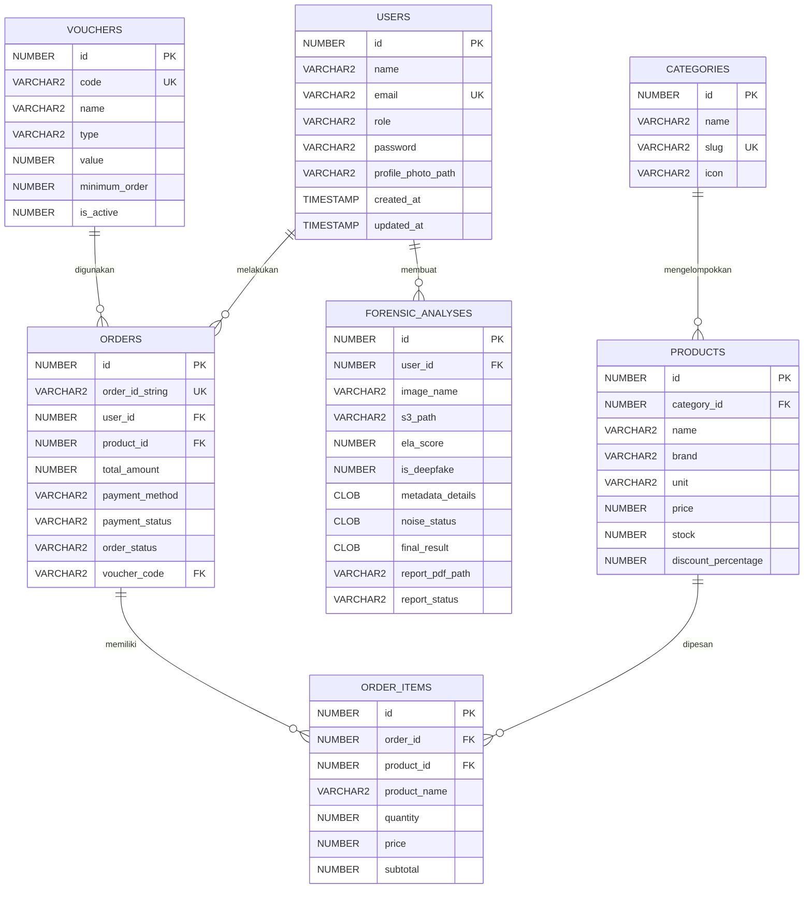

# LAPORAN BASIS DATA - VERIDITY

## 1. Deskripsi Sistem

VERIDITY adalah aplikasi forensik digital untuk membantu pengguna memeriksa apakah foto, nota pembayaran, atau dokumen memiliki indikasi hasil AI, hasil editan, atau campuran antara tulisan manusia dan AI. Sistem terdiri dari website Laravel, aplikasi mobile Flutter, engine Python, dan website distributor `distri`.

Untuk mata kuliah Basis Data, fokus utama sistem adalah website Laravel yang terhubung ke Oracle. Database menyimpan data user, hasil analisis forensik, produk distributor, order, item order, voucher, dan status validasi nota.

## 2. Perancangan Database

### 2.1 ERD

Entitas utama yang digunakan:

1. `users`
2. `forensic_analyses`
3. `categories`
4. `products`
5. `orders`
6. `order_items`
7. `vouchers`



### 2.2 CDM

Model konseptual sistem:

- User dapat melakukan banyak analisis forensik.
- User distributor atau reseller dapat membuat banyak order.
- Produk dikelompokkan oleh kategori.
- Order memiliki banyak item order.
- Item order menyimpan snapshot nama produk, harga, kuantitas, dan subtotal saat transaksi dibuat.
- Voucher dapat digunakan pada order untuk memberi potongan harga.
- Hasil validasi nota dari VERIDITY disimpan pada order distributor.

Relasi konseptual:

| Entitas Asal | Relasi | Entitas Tujuan |
| --- | --- | --- |
| User | 1 ke banyak | Forensic Analysis |
| User | 1 ke banyak | Order |
| Category | 1 ke banyak | Product |
| Order | 1 ke banyak | Order Item |
| Product | 1 ke banyak | Order Item |
| Voucher | 1 ke banyak | Order |

### 2.3 PDM Oracle

PDM berikut menggambarkan implementasi fisik di Oracle.

#### Tabel `users`

| Kolom | Tipe Data Oracle | Keterangan |
| --- | --- | --- |
| id | NUMBER | Primary key |
| name | VARCHAR2(255) | Nama user |
| email | VARCHAR2(255) | Unique |
| role | VARCHAR2(30) | Role user/admin/reseller |
| email_verified_at | TIMESTAMP | Verifikasi email |
| password | VARCHAR2(255) | Password hash |
| profile_photo_path | VARCHAR2(255) | Foto profil |
| remember_token | VARCHAR2(100) | Token remember |
| created_at | TIMESTAMP | Waktu dibuat |
| updated_at | TIMESTAMP | Waktu diubah |

#### Tabel `forensic_analyses`

| Kolom | Tipe Data Oracle | Keterangan |
| --- | --- | --- |
| id | NUMBER | Primary key |
| user_id | NUMBER | Foreign key ke `users.id` |
| image_name | VARCHAR2(255) | Nama file |
| s3_path | VARCHAR2(255) | Path file |
| ela_score | NUMBER(5,2) | Skor ELA |
| is_deepfake | NUMBER(1) | Flag deepfake |
| metadata_details | CLOB | Detail metadata |
| noise_status | CLOB | Detail noise |
| final_result | CLOB | Hasil akhir analisis |
| report_pdf_path | VARCHAR2(255) | Path PDF report |
| report_status | VARCHAR2(50) | Status report |
| report_error | CLOB | Error generate report |
| report_version | NUMBER | Versi report |
| created_at | TIMESTAMP | Waktu dibuat |
| updated_at | TIMESTAMP | Waktu diubah |

#### Tabel `categories`

| Kolom | Tipe Data Oracle | Keterangan |
| --- | --- | --- |
| id | NUMBER | Primary key |
| name | VARCHAR2(120) | Nama kategori |
| slug | VARCHAR2(140) | Unique |
| icon | VARCHAR2(60) | Nama ikon |
| created_at | TIMESTAMP | Waktu dibuat |
| updated_at | TIMESTAMP | Waktu diubah |

#### Tabel `products`

| Kolom | Tipe Data Oracle | Keterangan |
| --- | --- | --- |
| id | NUMBER | Primary key |
| category_id | NUMBER | Foreign key ke `categories.id` |
| external_id | VARCHAR2(80) | ID data dummy/API |
| name | VARCHAR2(255) | Nama produk |
| brand | VARCHAR2(120) | Merek |
| description | CLOB | Deskripsi |
| unit | VARCHAR2(100) | Satuan |
| min_qty | NUMBER | Minimal pembelian |
| price | NUMBER(12,2) | Harga sebelum diskon |
| stock | NUMBER | Stok |
| rating | NUMBER(3,2) | Rating produk |
| discount_percentage | NUMBER(5,2) | Diskon produk |
| image | VARCHAR2(255) | File gambar lokal |
| image_url | CLOB | URL gambar |
| created_at | TIMESTAMP | Waktu dibuat |
| updated_at | TIMESTAMP | Waktu diubah |

#### Tabel `orders`

| Kolom | Tipe Data Oracle | Keterangan |
| --- | --- | --- |
| id | NUMBER | Primary key |
| order_id_string | VARCHAR2(50) | Unique invoice |
| user_id | NUMBER | Foreign key ke `users.id` |
| product_id | NUMBER | Foreign key ke `products.id` |
| quantity | NUMBER | Total kuantitas |
| total_amount | NUMBER(12,2) | Total pembayaran |
| proof_of_transfer | VARCHAR2(255) | Bukti transfer |
| payment_method | VARCHAR2(50) | Metode pembayaran |
| payment_channel | VARCHAR2(80) | Channel pembayaran |
| payment_status | VARCHAR2(50) | Status pembayaran |
| order_status | VARCHAR2(40) | Status pesanan |
| payment_instruction | CLOB | Instruksi pembayaran |
| shipping_address | CLOB | Alamat pengiriman |
| voucher_code | VARCHAR2(40) | Referensi logis ke `vouchers.code` |
| discount_amount | NUMBER(12,2) | Potongan voucher |
| shipping_fee | NUMBER(12,2) | Ongkir |
| veridity_status | VARCHAR2(50) | Status validasi nota |
| veridity_audit_id | NUMBER | ID audit VERIDITY |
| veridity_score | NUMBER(7,2) | Skor validasi |
| veridity_message | CLOB | Pesan validasi |
| veridity_validation_details | CLOB | Detail validasi |
| veridity_checked_at | TIMESTAMP | Waktu validasi |
| created_at | TIMESTAMP | Waktu dibuat |
| updated_at | TIMESTAMP | Waktu diubah |

#### Tabel `order_items`

| Kolom | Tipe Data Oracle | Keterangan |
| --- | --- | --- |
| id | NUMBER | Primary key |
| order_id | NUMBER | Foreign key ke `orders.id` |
| product_id | NUMBER | Foreign key ke `products.id` |
| product_name | VARCHAR2(255) | Snapshot nama produk |
| quantity | NUMBER | Jumlah |
| price | NUMBER(12,2) | Harga setelah diskon produk |
| subtotal | NUMBER(12,2) | Subtotal item |
| created_at | TIMESTAMP | Waktu dibuat |
| updated_at | TIMESTAMP | Waktu diubah |

#### Tabel `vouchers`

| Kolom | Tipe Data Oracle | Keterangan |
| --- | --- | --- |
| id | NUMBER | Primary key |
| code | VARCHAR2(40) | Unique |
| name | VARCHAR2(120) | Nama voucher |
| type | VARCHAR2(20) | Percent/fixed |
| value | NUMBER(10,2) | Nilai voucher |
| minimum_order | NUMBER(12,2) | Minimal belanja |
| is_active | NUMBER(1) | Status aktif |
| created_at | TIMESTAMP | Waktu dibuat |
| updated_at | TIMESTAMP | Waktu diubah |

## 3. Aplikasi Web

### 3.1 Backend

Backend menggunakan PHP dengan framework Laravel. Laravel bertugas untuk:

- Autentikasi user.
- CRUD data produk distributor.
- Menyimpan hasil analisis foto/dokumen.
- Menghubungkan website dengan Oracle.
- Menghubungkan website dengan Python engine.
- Menyediakan API untuk Flutter dan integrasi `distri`.

Driver Oracle yang digunakan adalah `yajra/laravel-oci8`.

### 3.2 Frontend

Frontend menggunakan Blade Laravel, HTML, CSS, dan JavaScript. Tampilan terdiri dari:

- Login/register.
- Dashboard user.
- Upload file analisis.
- Riwayat analisis.
- Detail analisis dan download PDF.
- Katalog produk distributor.
- Checkout, voucher, dan riwayat pesanan.
- Dashboard admin untuk CRUD produk, pantau toko, pantau pesanan, dan validasi nota.

### 3.3 Fitur Minimal

| Fitur | Implementasi |
| --- | --- |
| Login/authentication | Laravel Auth dan session |
| CRUD data utama | CRUD produk pada admin distributor |
| Menampilkan data dari Oracle | Produk, order, user, hasil analisis |
| Validasi input | Laravel Request validation pada register, login, checkout, upload, produk |
| Demo CRUD | Tambah, edit, hapus, dan cari produk |

## 4. Implementasi Database Oracle

### 4.1 Pembuatan Tablespace

```sql
CREATE TABLESPACE VERIDITY_TS
DATAFILE 'veridity01.dbf'
SIZE 500M
AUTOEXTEND ON
NEXT 100M
MAXSIZE 2G;
```

### 4.2 Pembuatan User

```sql
CREATE USER VERIDITY
IDENTIFIED BY "password_oracle"
DEFAULT TABLESPACE VERIDITY_TS
TEMPORARY TABLESPACE TEMP;
```

### 4.3 Role dan Privilege

```sql
GRANT CREATE SESSION TO VERIDITY;
GRANT CREATE TABLE TO VERIDITY;
GRANT CREATE SEQUENCE TO VERIDITY;
GRANT CREATE VIEW TO VERIDITY;
GRANT CREATE PROCEDURE TO VERIDITY;
ALTER USER VERIDITY QUOTA UNLIMITED ON VERIDITY_TS;
```

Prinsip yang digunakan adalah least privilege. User aplikasi hanya diberi hak yang dibutuhkan untuk menjalankan aplikasi dan migrasi, bukan hak DBA penuh.

### 4.4 Index dan Constraint

Constraint yang diterapkan:

- Primary key pada setiap tabel utama.
- Unique constraint pada `users.email`.
- Unique constraint pada `orders.order_id_string`.
- Unique constraint pada `categories.slug`.
- Unique constraint pada `vouchers.code`.
- Foreign key dari `forensic_analyses.user_id` ke `users.id`.
- Foreign key dari `products.category_id` ke `categories.id`.
- Foreign key dari `orders.user_id` ke `users.id`.
- Foreign key dari `orders.product_id` ke `products.id`.
- Foreign key dari `order_items.order_id` ke `orders.id`.
- Foreign key dari `order_items.product_id` ke `products.id`.
- Relasi `orders.voucher_code` ke `vouchers.code` digunakan sebagai referensi logis pada aplikasi.

Contoh index tambahan:

```sql
CREATE INDEX IDX_FORENSIC_USER ON FORENSIC_ANALYSES (USER_ID);
CREATE INDEX IDX_ORDERS_USER ON ORDERS (USER_ID);
CREATE INDEX IDX_ORDERS_STATUS ON ORDERS (ORDER_STATUS, PAYMENT_STATUS);
CREATE INDEX IDX_PRODUCTS_CATEGORY ON PRODUCTS (CATEGORY_ID);
```

## 5. Administrasi Database DBA

### 5.1 Manajemen User

User database utama adalah `VERIDITY`. User ini digunakan oleh aplikasi Laravel untuk koneksi ke Oracle.

```sql
CREATE USER VERIDITY IDENTIFIED BY "password_oracle";
GRANT CREATE SESSION TO VERIDITY;
```

Untuk demo keamanan, dapat dibuat user read-only.

```sql
CREATE USER VERIDITY_READONLY IDENTIFIED BY "readonly_password";
GRANT CREATE SESSION TO VERIDITY_READONLY;
GRANT SELECT ON VERIDITY.USERS TO VERIDITY_READONLY;
GRANT SELECT ON VERIDITY.FORENSIC_ANALYSES TO VERIDITY_READONLY;
GRANT SELECT ON VERIDITY.PRODUCTS TO VERIDITY_READONLY;
GRANT SELECT ON VERIDITY.ORDERS TO VERIDITY_READONLY;
```

### 5.2 Storage Management

Storage dikelola melalui tablespace `VERIDITY_TS` dan datafile `veridity01.dbf`.

```sql
ALTER DATABASE DATAFILE 'veridity01.dbf' AUTOEXTEND ON NEXT 100M MAXSIZE 2G;
```

### 5.3 Security

Strategi keamanan:

- Password user database tidak disimpan di source code, tetapi di `.env`.
- Akses aplikasi memakai user database khusus.
- User read-only hanya memiliki hak `SELECT`.
- Field sensitif seperti password disimpan dalam bentuk hash.
- Integrasi `distri` ke VERIDITY memakai `VERIDITY_INTEGRATION_KEY`.

## 6. Koneksi Web ke Oracle

### 6.1 Listener dan Service Name

Oracle harus memiliki listener aktif.

```bash
lsnrctl status
```

Contoh service name:

```text
XE
```

### 6.2 Konfigurasi Backend Laravel

Contoh `.env`:

```env
DB_CONNECTION=oracle
DB_HOST=127.0.0.1
DB_PORT=1521
DB_SERVICE_NAME=XE
DB_USERNAME=VERIDITY
DB_PASSWORD=password_oracle
```

Setelah mengubah konfigurasi:

```bash
php artisan config:clear
php artisan migrate
```

## 7. Output yang Dikumpulkan

### 7.1 Aplikasi Web

Output aplikasi web terdiri dari:

- Website `veridity-laravel`.
- Website `distri`.
- Backend Laravel yang terkoneksi ke Oracle.
- Python engine sebagai service pendukung analisis.

### 7.2 Database Oracle

Output database:

- Struktur tabel sesuai PDM.
- Relasi antar tabel.
- Index dan constraint.
- User Oracle, privilege, tablespace, dan datafile.

### 7.3 Desain Database

Desain database berisi:

- ERD.
- CDM.
- PDM.

### 7.4 Laporan

Laporan mencakup:

- Deskripsi sistem.
- Diagram database.
- Implementasi DBA.
- Implementasi aplikasi.
- Koneksi web ke Oracle.
- Skenario demo CRUD.

### 7.5 Demo CRUD

Skenario demo:

1. Login sebagai admin distributor.
2. Tambah produk baru.
3. Edit nama, kategori, stok, harga, dan diskon produk.
4. Cari produk melalui fitur search admin.
5. Hapus atau nonaktifkan produk.
6. Login sebagai reseller.
7. Tambahkan produk ke keranjang.
8. Checkout dengan voucher.
9. Admin memantau status pesanan dan validasi nota.

## 8. Kesimpulan

VERIDITY memenuhi kebutuhan mata kuliah Basis Data karena memiliki perancangan database, implementasi Oracle, fitur web frontend dan backend, autentikasi, CRUD data utama, validasi input, serta administrasi database berupa user, privilege, tablespace, dan security. Sistem juga memiliki relasi antar entitas yang jelas dan dapat didemokan melalui flow analisis forensik serta transaksi distributor.
