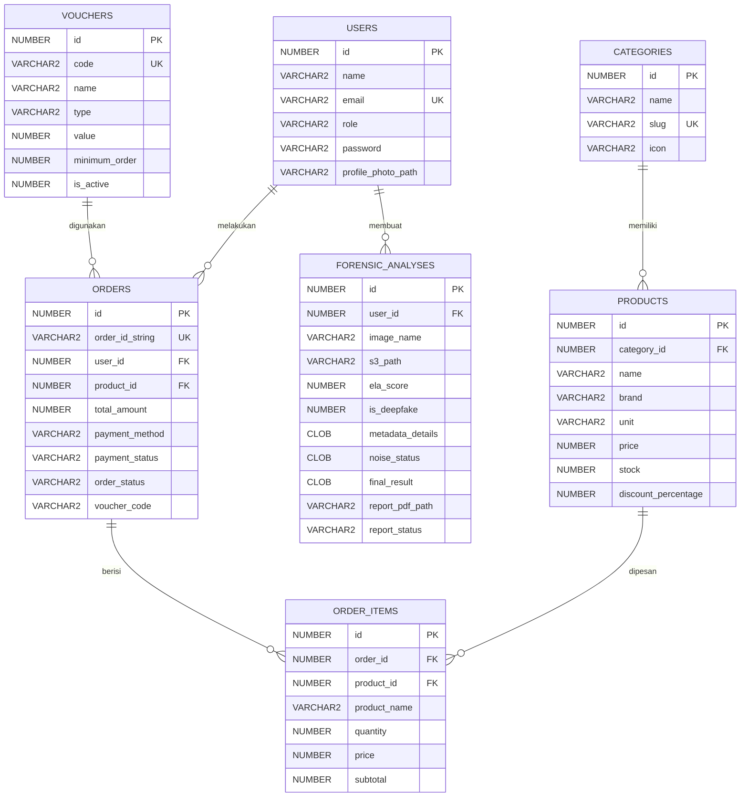

# LAPORAN BASIS DATA - VERIDITY

## 1. Deskripsi Sistem

VERIDITY adalah sistem forensik digital untuk mendeteksi indikasi foto, nota pembayaran, dan dokumen yang dibuat oleh AI, diedit, atau memiliki campur tangan manusia dan AI. Sistem terdiri dari:

- `veridity-laravel`: website utama, API, autentikasi, upload file, riwayat analisis, dashboard user/admin, dan penyimpanan hasil analisis.
- `distri`: website distributor/toko untuk katalog produk, checkout, voucher, pesanan, upload nota, dan validasi bukti pembayaran melalui VERIDITY.
- `python`: engine analisis foto/dokumen dan generate PDF report.
- `veridity_mobile`: aplikasi Flutter sebagai client mobile. Untuk laporan basis data, mobile hanya menjadi konsumen API dan tidak menjadi fokus utama Oracle.

Untuk mata kuliah Basis Data, fokus implementasi adalah aplikasi web Laravel yang terkoneksi ke Oracle. Database Oracle dipakai untuk menyimpan user, hasil analisis forensik, produk, order, item order, voucher, serta status validasi nota.

Implementasi Oracle menggunakan dua schema:

- `VERIDITY`: schema untuk aplikasi forensik utama.
- `DISTRI`: schema untuk aplikasi distributor/toko.

Kedua schema memakai tablespace `VERIDITY_TS` agar administrasi storage tetap terpusat, tetapi data tetap dipisahkan sesuai batas aplikasi.

## 2. Perancangan Database

### 2.1 ERD (Entity Relationship Diagram)

Entitas utama:

1. `users`
2. `forensic_analyses`
3. `categories`
4. `products`
5. `orders`
6. `order_items`
7. `vouchers`

Relasi utama:

- User memiliki banyak hasil analisis.
- User/reseller memiliki banyak order.
- Category memiliki banyak product.
- Product muncul pada banyak order item.
- Order memiliki banyak order item.
- Voucher dapat digunakan oleh banyak order.



### 2.2 CDM (Conceptual Data Model)

CDM menggambarkan model konseptual tanpa fokus pada tipe data teknis. Model konseptual VERIDITY terdiri dari:

| Entitas | Deskripsi |
| --- | --- |
| User | Pengguna sistem, admin, atau reseller |
| Forensic Analysis | Riwayat dan hasil analisis foto/dokumen |
| Category | Kelompok produk distributor |
| Product | Data produk minimarket/distributor |
| Order | Transaksi pembelian reseller |
| Order Item | Detail produk dalam satu order |
| Voucher | Data potongan harga yang dapat digunakan saat checkout |

Relasi CDM:

| Relasi | Kardinalitas | Keterangan |
| --- | --- | --- |
| User - Forensic Analysis | 1 : N | Satu user dapat melakukan banyak analisis |
| User - Order | 1 : N | Satu reseller dapat membuat banyak order |
| Category - Product | 1 : N | Satu kategori memiliki banyak produk |
| Product - Order Item | 1 : N | Satu produk dapat muncul pada banyak item order |
| Order - Order Item | 1 : N | Satu order memiliki banyak item |
| Voucher - Order | 0/1 : N | Satu voucher dapat digunakan pada banyak order, order boleh tanpa voucher |

Catatan CDM:

- Atribut `id` menjadi identifier utama setiap entitas.
- `email`, `slug`, `order_id_string`, dan `code` menjadi alternate identifier/unique key.
- Atribut FK seperti `user_id`, `product_id`, dan `category_id` pada CDM direpresentasikan oleh relasi antar entitas.

### 2.3 PDM (Physical Data Model) Oracle

PDM adalah implementasi fisik pada Oracle. Tipe data yang digunakan:

- `NUMBER` untuk ID, angka, status boolean, dan nilai numerik.
- `VARCHAR2` untuk teks pendek.
- `CLOB` untuk teks panjang/JSON besar.
- `TIMESTAMP` untuk waktu.

#### Tabel `USERS`

| Kolom | Tipe Data | Constraint/Keterangan |
| --- | --- | --- |
| id | NUMBER | PK |
| name | VARCHAR2(255) | NOT NULL |
| email | VARCHAR2(255) | UNIQUE, NOT NULL |
| role | VARCHAR2(30) | NOT NULL |
| email_verified_at | TIMESTAMP | NULL |
| password | VARCHAR2(255) | NOT NULL |
| profile_photo_path | VARCHAR2(255) | NULL |
| remember_token | VARCHAR2(100) | NULL |
| created_at | TIMESTAMP | NULL |
| updated_at | TIMESTAMP | NULL |

#### Tabel `FORENSIC_ANALYSES`

| Kolom | Tipe Data | Constraint/Keterangan |
| --- | --- | --- |
| id | NUMBER | PK |
| user_id | NUMBER | FK ke `USERS.id` |
| image_name | VARCHAR2(255) | NOT NULL |
| s3_path | VARCHAR2(255) | Path file/foto |
| ela_score | NUMBER(5,2) | Skor ELA |
| is_deepfake | NUMBER(1) | Flag deepfake |
| metadata_details | CLOB | Metadata/JSON |
| noise_status | CLOB | Detail noise |
| final_result | CLOB | Hasil akhir |
| report_pdf_path | VARCHAR2(255) | Path report PDF |
| report_status | VARCHAR2(50) | Status report |
| report_error | CLOB | Error report |
| report_version | NUMBER | Versi report |
| created_at | TIMESTAMP | NULL |
| updated_at | TIMESTAMP | NULL |

#### Tabel `CATEGORIES`

| Kolom | Tipe Data | Constraint/Keterangan |
| --- | --- | --- |
| id | NUMBER | PK |
| name | VARCHAR2(120) | NOT NULL |
| slug | VARCHAR2(140) | UNIQUE |
| icon | VARCHAR2(60) | NULL |
| created_at | TIMESTAMP | NULL |
| updated_at | TIMESTAMP | NULL |

#### Tabel `PRODUCTS`

| Kolom | Tipe Data | Constraint/Keterangan |
| --- | --- | --- |
| id | NUMBER | PK |
| category_id | NUMBER | FK ke `CATEGORIES.id` |
| external_id | VARCHAR2(80) | ID data dummy/API |
| name | VARCHAR2(255) | NOT NULL |
| brand | VARCHAR2(120) | NULL |
| description | CLOB | Deskripsi produk |
| unit | VARCHAR2(100) | NOT NULL |
| min_qty | NUMBER | Minimal pembelian |
| price | NUMBER(12,2) | Harga sebelum diskon |
| stock | NUMBER | Stok |
| rating | NUMBER(3,2) | Rating |
| discount_percentage | NUMBER(5,2) | Diskon produk |
| image | VARCHAR2(255) | Nama file gambar |
| image_url | CLOB | URL gambar |
| created_at | TIMESTAMP | NULL |
| updated_at | TIMESTAMP | NULL |

#### Tabel `ORDERS`

| Kolom | Tipe Data | Constraint/Keterangan |
| --- | --- | --- |
| id | NUMBER | PK |
| order_id_string | VARCHAR2(50) | UNIQUE |
| user_id | NUMBER | FK ke `USERS.id` |
| product_id | NUMBER | FK ke `PRODUCTS.id` |
| quantity | NUMBER | Total kuantitas |
| total_amount | NUMBER(12,2) | Total pembayaran |
| proof_of_transfer | VARCHAR2(255) | Bukti pembayaran |
| payment_method | VARCHAR2(50) | Metode pembayaran |
| payment_channel | VARCHAR2(80) | Channel pembayaran |
| payment_status | VARCHAR2(50) | Status pembayaran |
| order_status | VARCHAR2(40) | Status pesanan |
| payment_instruction | CLOB | Instruksi pembayaran |
| shipping_address | CLOB | Alamat pengiriman |
| voucher_code | VARCHAR2(40) | Referensi logis ke `VOUCHERS.code` |
| discount_amount | NUMBER(12,2) | Potongan voucher |
| shipping_fee | NUMBER(12,2) | Ongkir |
| veridity_status | VARCHAR2(50) | Status validasi nota |
| veridity_audit_id | NUMBER | ID audit VERIDITY |
| veridity_score | NUMBER(7,2) | Skor validasi |
| veridity_message | CLOB | Pesan validasi |
| veridity_validation_details | CLOB | Detail validasi |
| veridity_checked_at | TIMESTAMP | Waktu validasi |
| created_at | TIMESTAMP | NULL |
| updated_at | TIMESTAMP | NULL |

#### Tabel `ORDER_ITEMS`

| Kolom | Tipe Data | Constraint/Keterangan |
| --- | --- | --- |
| id | NUMBER | PK |
| order_id | NUMBER | FK ke `ORDERS.id` |
| product_id | NUMBER | FK ke `PRODUCTS.id` |
| product_name | VARCHAR2(255) | Snapshot nama produk |
| quantity | NUMBER | Jumlah |
| price | NUMBER(12,2) | Harga setelah diskon produk |
| subtotal | NUMBER(12,2) | Subtotal |
| created_at | TIMESTAMP | NULL |
| updated_at | TIMESTAMP | NULL |

#### Tabel `VOUCHERS`

| Kolom | Tipe Data | Constraint/Keterangan |
| --- | --- | --- |
| id | NUMBER | PK |
| code | VARCHAR2(40) | UNIQUE |
| name | VARCHAR2(120) | NOT NULL |
| type | VARCHAR2(20) | Percent/fixed |
| value | NUMBER(10,2) | Nilai voucher |
| minimum_order | NUMBER(12,2) | Minimal belanja |
| is_active | NUMBER(1) | Status aktif |
| created_at | TIMESTAMP | NULL |
| updated_at | TIMESTAMP | NULL |

## 3. Aplikasi Web (Frontend + Backend)

### 3.1 Backend

Backend menggunakan PHP dengan framework Laravel.

Implementasi backend:

- Koneksi ke Oracle memakai driver `yajra/laravel-oci8`.
- Autentikasi user/admin/reseller.
- CRUD produk distributor.
- Upload dan penyimpanan hasil analisis.
- Integrasi ke Python engine untuk analisis foto/dokumen.
- API untuk Flutter dan integrasi `distri`.
- Validasi nota dari `distri` ke VERIDITY.

### 3.2 Frontend

Frontend menggunakan Laravel Blade, HTML, CSS, dan JavaScript.

Halaman utama:

- Login dan register.
- Dashboard user.
- Upload foto/dokumen.
- Riwayat analisis.
- Detail analisis dan download PDF.
- Dashboard admin VERIDITY.
- Katalog produk `distri`.
- Keranjang, voucher, checkout, dan riwayat pesanan.
- Dashboard admin `distri` untuk kelola produk, toko, pesanan, dan validasi nota.

### 3.3 Fitur Minimal

| Syarat | Implementasi |
| --- | --- |
| Login/authentication | Laravel session auth dan API token |
| CRUD data utama | CRUD produk pada admin `distri` |
| Menampilkan data Oracle | Produk, order, user, riwayat analisis, validasi nota |
| Validasi input | Laravel validation pada auth, produk, checkout, upload, dan profil |

## 4. Implementasi Database Oracle

### 4.1 Pembuatan Database dan Schema

Oracle memakai dua schema:

- `VERIDITY`
- `DISTRI`

Contoh pembuatan user:

```sql
CREATE USER VERIDITY IDENTIFIED BY "password_oracle"
DEFAULT TABLESPACE VERIDITY_TS
TEMPORARY TABLESPACE TEMP
QUOTA UNLIMITED ON VERIDITY_TS;

CREATE USER DISTRI IDENTIFIED BY "password_oracle"
DEFAULT TABLESPACE VERIDITY_TS
TEMPORARY TABLESPACE TEMP
QUOTA UNLIMITED ON VERIDITY_TS;
```

### 4.2 Pembuatan Tabel

Tabel dibuat melalui migration Laravel. Tabel utama:

Schema `VERIDITY`:

- `USERS`
- `FORENSIC_ANALYSES`
- `PERSONAL_ACCESS_TOKENS`
- tabel pendukung Laravel seperti `CACHE`, `JOBS`, `SESSIONS`, dan `MIGRATIONS`

Schema `DISTRI`:

- `USERS`
- `CATEGORIES`
- `PRODUCTS`
- `ORDERS`
- `ORDER_ITEMS`
- `VOUCHERS`
- `CART_ITEMS`
- `SHIPPING_ADDRESSES`
- tabel pendukung Laravel seperti `CACHE`, `JOBS`, `SESSIONS`, dan `MIGRATIONS`

### 4.3 Relasi Antar Tabel

Relasi yang digunakan:

- `FORENSIC_ANALYSES.user_id` ke `USERS.id`.
- `PRODUCTS.category_id` ke `CATEGORIES.id`.
- `ORDERS.user_id` ke `USERS.id`.
- `ORDERS.product_id` ke `PRODUCTS.id`.
- `ORDER_ITEMS.order_id` ke `ORDERS.id`.
- `ORDER_ITEMS.product_id` ke `PRODUCTS.id`.
- `ORDERS.voucher_code` ke `VOUCHERS.code` sebagai referensi logis aplikasi.

### 4.4 Index dan Constraint

Constraint:

- Primary key pada setiap tabel utama.
- Unique key pada `USERS.email`.
- Unique key pada `CATEGORIES.slug`.
- Unique key pada `ORDERS.order_id_string`.
- Unique key pada `VOUCHERS.code`.
- Foreign key antar tabel sesuai relasi PDM.

Contoh query verifikasi:

```sql
SELECT CONSTRAINT_NAME, CONSTRAINT_TYPE, TABLE_NAME, STATUS
FROM USER_CONSTRAINTS
ORDER BY TABLE_NAME, CONSTRAINT_TYPE;
```

Index:

- Index bawaan primary key dan unique key.
- Index Laravel untuk cache, queue, session, dan token.
- Index relasi untuk mempercepat join.

Contoh query verifikasi:

```sql
SELECT INDEX_NAME, TABLE_NAME, UNIQUENESS, STATUS
FROM USER_INDEXES
ORDER BY TABLE_NAME, INDEX_NAME;
```

## 5. Administrasi Database (DBA)

### 5.1 Manajemen User

User/schema:

- `VERIDITY`: akses database aplikasi forensik.
- `DISTRI`: akses database aplikasi distributor/toko.

Role luas seperti `DBA`, `CONNECT`, dan `RESOURCE` dicabut. User aplikasi hanya diberi privilege eksplisit yang dibutuhkan.

Privilege:

```sql
GRANT CREATE SESSION TO VERIDITY CONTAINER=ALL;
GRANT CREATE TABLE TO VERIDITY CONTAINER=ALL;
GRANT CREATE SEQUENCE TO VERIDITY CONTAINER=ALL;
GRANT CREATE VIEW TO VERIDITY CONTAINER=ALL;
GRANT CREATE PROCEDURE TO VERIDITY CONTAINER=ALL;
GRANT CREATE TRIGGER TO VERIDITY CONTAINER=ALL;

GRANT CREATE SESSION TO DISTRI CONTAINER=ALL;
GRANT CREATE TABLE TO DISTRI CONTAINER=ALL;
GRANT CREATE SEQUENCE TO DISTRI CONTAINER=ALL;
GRANT CREATE VIEW TO DISTRI CONTAINER=ALL;
GRANT CREATE PROCEDURE TO DISTRI CONTAINER=ALL;
GRANT CREATE TRIGGER TO DISTRI CONTAINER=ALL;
```

Verifikasi privilege:

```sql
SELECT GRANTEE, PRIVILEGE, COMMON, INHERITED
FROM DBA_SYS_PRIVS
WHERE GRANTEE IN ('VERIDITY', 'DISTRI')
ORDER BY GRANTEE, PRIVILEGE;
```

### 5.2 Role dan Privilege

Role yang tidak digunakan:

- `DBA`
- `CONNECT`
- `RESOURCE`

Verifikasi role:

```sql
SELECT *
FROM DBA_ROLE_PRIVS
WHERE GRANTEE IN ('VERIDITY', 'DISTRI')
ORDER BY GRANTEE, GRANTED_ROLE;
```

Target hasil: 0 row untuk role luas.

### 5.3 Storage Management

Storage dikelola melalui tablespace:

```sql
CREATE TABLESPACE VERIDITY_TS
DATAFILE 'C:\ORACLE21C\DB\ORADATA\VERIDITY_TS01.DBF'
SIZE 500M
AUTOEXTEND ON
NEXT 100M
MAXSIZE 2G;
```

Verifikasi tablespace:

```sql
SELECT TABLESPACE_NAME, STATUS, CONTENTS
FROM DBA_TABLESPACES
WHERE TABLESPACE_NAME = 'VERIDITY_TS';
```

Verifikasi datafile:

```sql
SELECT FILE_NAME, TABLESPACE_NAME, BYTES / 1024 / 1024 AS SIZE_MB, AUTOEXTENSIBLE
FROM DBA_DATA_FILES
WHERE TABLESPACE_NAME = 'VERIDITY_TS';
```

Verifikasi quota:

```sql
SELECT USERNAME, TABLESPACE_NAME, BYTES / 1024 / 1024 AS USED_MB, MAX_BYTES / 1024 / 1024 AS MAX_MB
FROM DBA_TS_QUOTAS
WHERE USERNAME IN ('VERIDITY', 'DISTRI')
ORDER BY USERNAME;
```

### 5.4 Security

Strategi keamanan:

- Password database disimpan pada `.env`, bukan di source code.
- User aplikasi tidak memakai role `DBA`.
- Privilege memakai prinsip least privilege.
- Password aplikasi disimpan dalam bentuk hash.
- Integrasi `distri` ke VERIDITY memakai `VERIDITY_INTEGRATION_KEY`.
- File sensitif dan credential AWS tidak dimasukkan ke repository.

## 6. Koneksi Web ke Oracle

### 6.1 Listener dan Service Name

Oracle listener harus aktif.

```bash
lsnrctl status
```

Informasi koneksi yang dibutuhkan:

- Host: `127.0.0.1` atau alamat server Oracle.
- Port: `1521`.
- Service name: contoh `XE` atau `XEPDB1`.
- Username: `VERIDITY` atau `DISTRI`.
- Password: sesuai user Oracle.

### 6.2 Konfigurasi Backend Laravel

Contoh `.env` `veridity-laravel`:

```env
DB_CONNECTION=oracle
DB_HOST=127.0.0.1
DB_PORT=1521
DB_SERVICE_NAME=XE
DB_USERNAME=VERIDITY
DB_PASSWORD=password_oracle
```

Contoh `.env` `distri`:

```env
DB_CONNECTION=oracle
DB_HOST=127.0.0.1
DB_PORT=1521
DB_SERVICE_NAME=XE
DB_USERNAME=DISTRI
DB_PASSWORD=password_oracle
```

Setelah mengubah koneksi:

```bash
php artisan config:clear
php artisan migrate
```

## 7. Output yang Dikumpulkan

### 7.1 Aplikasi Web

Output:

- Website `veridity-laravel` berjalan.
- Website `distri` berjalan.
- Backend Laravel terkoneksi ke Oracle.
- Python engine berjalan sebagai service pendukung analisis.

### 7.2 Database Oracle

Output:

- Schema `VERIDITY` dan `DISTRI`.
- Tabel sesuai PDM.
- Relasi antar tabel.
- Constraint dan index.
- Tablespace `VERIDITY_TS`.
- Datafile dan quota user.
- Privilege eksplisit tanpa role `DBA`.

### 7.3 Desain Database

Output desain:

- ERD.
- CDM dari PowerDesigner.
- PDM Oracle dari PowerDesigner/reverse engineering.

### 7.4 Laporan

Isi laporan:

- Deskripsi sistem.
- Diagram database.
- Implementasi Oracle.
- Administrasi DBA.
- Koneksi web ke Oracle.
- Fitur aplikasi.
- Skenario demo CRUD.

### 7.5 Demo

Skenario demo CRUD:

1. Login sebagai admin `distri`.
2. Tambah produk.
3. Edit produk.
4. Cari produk.
5. Hapus produk.
6. Login sebagai reseller.
7. Masukkan produk ke keranjang.
8. Checkout dan gunakan voucher.
9. Upload nota pembayaran.
10. Admin melihat validasi nota dan status pesanan.

Skenario demo VERIDITY:

1. Login sebagai user VERIDITY.
2. Upload foto/dokumen.
3. Sistem menjalankan Python engine.
4. Hasil analisis tersimpan di Oracle.
5. User melihat riwayat dan detail analisis.
6. User mengunduh PDF report.

## 8. Kesimpulan

VERIDITY memenuhi kebutuhan mata kuliah Basis Data karena memiliki perancangan ERD, CDM, dan PDM, implementasi database Oracle, web frontend dan backend, autentikasi, CRUD data utama, validasi input, koneksi backend ke Oracle, serta administrasi DBA berupa user, privilege, tablespace, datafile, constraint, index, dan prinsip least privilege.
